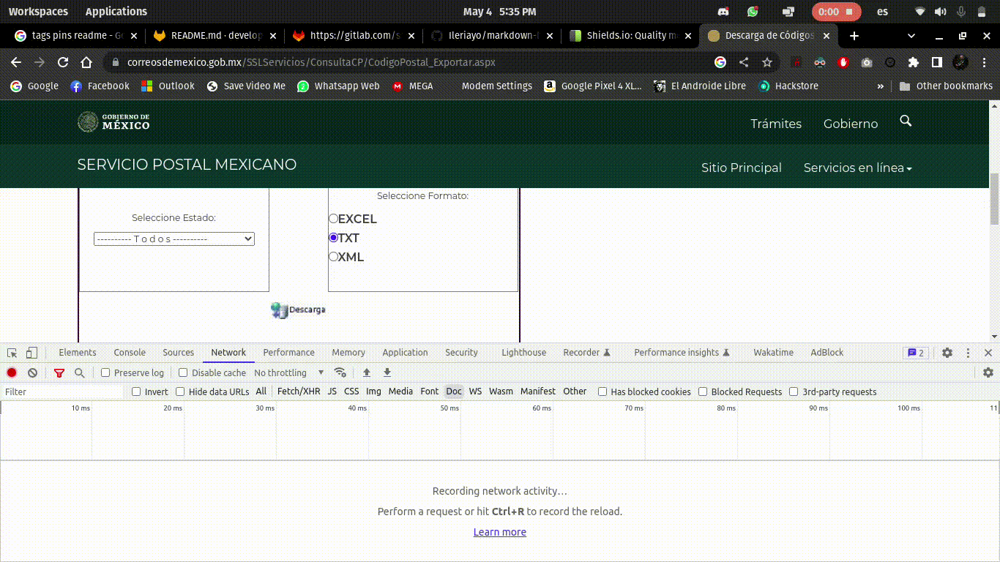

# Sepomex Downloader
Microservicio para descargar el ZIP de codigos postales proporcionado por el servicio postal mexicano

# Acerca del proyecto
En este proyecto se busca obtimizar el proceso de descargar e importar a una base de datos los codigos postales actualizadados proporcionados por SEPOMEX.

Sepomex no proporciona algun servicio web o documentacion para poder descargar dicho zip, sin embargo existe un metodo para poder descargarlo y volvar la informacion a una base de datos. Tambien el zip puede incluir los siguientes formatos que contengan los codigos postales
- TXT
- EXCEL
- XML

Tambien podemos selecionar de que esta condo especificamente queremos los codigs postales o del todo el pais.

# Como funciona
Si bien SEPOMEX no nos proporciona un servicio, hay una forma de poderlo decargar desde cualquier lenguaje con alguna libreria de HTTP, cuando nosotros selecionamos el estado y el formato, la pagina se llama a si misma para enviar los datos que hemos selecionado, pero no es una peticion de XHR que se pueda ver en el modo desarrollador sino que es de tipo DOC.

Sin embargo la peticion envia ciertos tokens y valores para poder realzar la accion. Por alguna razon estos tokens o llaves no caducan, parecieran ser solo para validar que ejecuten dicha accion, ya que al dia de hoy no han caducado.

## Funcionamiento interno
El microservicio para poder descargar el archivo realiza la peticion con todos los valores enviados en el navegador, ya internamente estan los valores requeridos para funcionar, ya que incluia mas son completamente innesesarios.

El microservicio ejecuta la peticion y el contenido enviado es el binario del archivo .ZIP, se valida que la peticion sea correcta, en caso de que no termina el proceso. Despues de validar se guarda el contenido binario en un archivo con nombre aleatorio (sepomex_txt_aleatorio.zip).

Despues mediante la extension zip valida que el zip sea correcto en caso de que no termina el proceso con un ´Exception´. En caso de que si descomprime el archivo que se encuentra dentro de el. Por el momento esta adaptado solo para el tipo TXT, en este caso leera el contenido despues de la 3 linea del archivo ya que las 3 primeras solo es de informacion de SEPOMEX. Despues de esa linea hara un `explode(contenido)` de toda la linea ya que cada columna esta separado por un `|`, al realizar esta accion empezara a guardar todos los codigos postales en la base de datos configurada.

